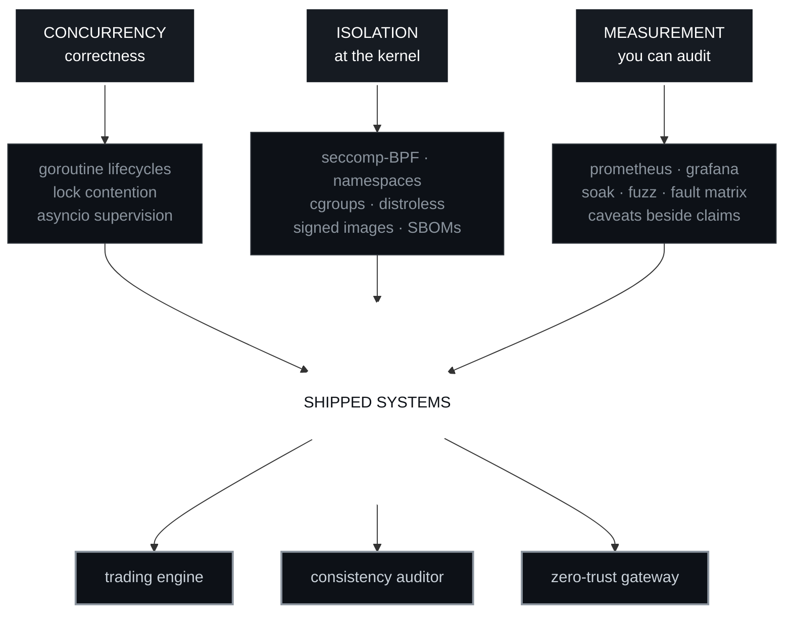

<div align="center">

<pre>
<b>██▄   ██   ▄█▀█▄   ██▀▀▀▀▀█▄ ██▀▀▀▀▀█▄   ▄█▀█▄   ██     ██ ██▄   ▄██   ▄█▀█▄
██▀█▄ ██ ▄█▀   ▀█▄ ██▄▄▄▄▄█▀ ██▄▄▄▄▄█▀ ▄█▀   ▀█▄ ██▄▄▄▄▄██ ██▀█▄█▀██ ▄█▀   ▀█▄
██  ▀███ ██▀▀▀▀▀██ ██     ██ ██   ▀█▄  ██▀▀▀▀▀██ ██     ██ ██     ██ ██▀▀▀▀▀██
▀▀    ▀▀ ▀▀     ▀▀ ▀▀▀▀▀▀▀▀  ▀▀     ▀▀ ▀▀     ▀▀ ▀▀     ▀▀ ▀▀     ▀▀ ▀▀     ▀▀</b>
</pre>


<br/>

<a href="https://nabaskarbrahma.vercel.app/"></a>
<a href="https://www.linkedin.com/in/nabaskar/"></a>
<a href="mailto:nabaskarforcode99@gmail.com"></a>
<a href="https://nabaskarbrahma.itch.io/"></a>


<pre>
▀▄▀▄▀▄▀▄▀▄▀▄▀▄▀▄▀▄▀▄▀▄▀▄▀▄▀▄▀▄▀▄▀▄▀▄▀▄▀▄▀▄▀▄▀▄▀▄▀▄▀▄▀▄▀▄▀▄▀▄▀▄▀▄▀▄▀▄▀▄▀▄▀▄▀▄▀▄
</pre>

</div>

## ▓▒░ BOOT SEQUENCE ░▒▓

```
nabrahma@localhost:~$ ./init --verbose

  [ OK ]  mounting /dev/kubernetes ....................... controller-runtime
  [ OK ]  loading seccomp-bpf profiles ................... 1 filter per tool, by subtraction
  [ OK ]  spawning asyncio supervisor ................... 5/5 tasks healthy
  [ OK ]  attaching prometheus exporter ................. 48 metrics, 10 alert rules
  [ OK ]  arming fault injection matrix ................. 60 rows, 20 consecutive passes
  [WARN]  false positive rate ........................... 25-50%, varies per run
  [WARN]  single-run dynamic analysis is a real limitation
  [ OK ]  honesty daemon ................................ running (never disabled)

  >> system online. 4 modules loaded. 0 claims without caveats.

nabrahma@localhost:~$ _
```

<div align="center">
<pre>
░░░░░░░░░░░░▒▒▒▒▒▒▒▒▒▒▒▒▓▓▓▓▓▓▓▓▓▓▓▓████████████▓▓▓▓▓▓▓▓▓▓▓▓▒▒▒▒▒▒▒▒▒▒▒▒░░░░░░░░░░░░
</pre>
</div>

## ▓▒░ CORE ARCHITECTURE ░▒▓



<div align="center">
<pre>
████▓▓▓▓▒▒▒▒░░░░                                                    ░░░░▒▒▒▒▓▓▓▓████
</pre>
</div>

## ▓▒░ MODULES LOADED ░▒▓

<details open>
<summary><code>[01]</code> <b>SHORTCIRCUIT</b> &nbsp;·&nbsp; live trading engine &nbsp;·&nbsp; <code>python · asyncio · postgres · docker</code></summary>

```
  TARGET    NSE equities via Fyers API v3 - real money, real fills
  SCALE     14.8K LOC / 42 modules / 1 event loop / 5 supervised tasks

  PIPELINE  WS cache -> hybrid -> REST fallback, behind a sliding-window limiter
            enforcing 10/sec + 200/min + 100K/day simultaneously, with a reserved
            priority lane so stop-loss cannot queue behind scanner traffic

  BUG       a WebSocket payload-nesting defect had silently prevented EVERY order
            fill from ever being confirmed. zero fills logged. for months.

  FIX       replayed recorded production traffic through the handlers and
            recovered 89 order IDs from logs that previously yielded nothing

  GUARD     248 tests, 100% branch coverage on order decisions, plus an AST test
            that FAILS THE BUILD if a strategy module imports anything with I/O
```

</details>

<details>
<summary><code>[02]</code> <b>DRIFTWATCH</b> &nbsp;·&nbsp; distributed consistency auditor &nbsp;·&nbsp; <code>go · kubernetes · redis · zeromq</code></summary>

```
  PURPOSE   detect SILENT divergence between an event stream and its derived
            Redis store, by rebuilding expected state as an independent 3rd consumer

  PROBLEM   8% false positives at 2,000 events/sec - the tool blaming the system
            for event loss the tool itself caused

  SOLVED    settlement window derived from MEASURED propagation lag, two-phase
            confirmation with version fencing, and trust states that classify
            self-inflicted loss as "suspect" rather than "drift"

  OPERATOR  controller-runtime + kubebuilder: CRD, validating/defaulting webhooks,
            leader election, finalizers. Helm chart + Grafana + 10 alert rules.

  BENCH     1M redis keys swept .......... 5.68s    (target: 10s)
            1M keys invalidated .......... 1.11us   (generation counter)
            60-min soak .................. 5,388,510 events / 0 dropped
            goroutines ................... flat 13, no growth
            coverage ..................... 91.6% across 10 test levels
```

</details>

<details>
<summary><code>[03]</code> <b>MCP ZERO-TRUST GATEWAY</b> &nbsp;·&nbsp; kernel confinement for AI agents &nbsp;·&nbsp; <code>python · seccomp · docker · fastapi</code> &nbsp;·&nbsp; <a href="https://pypi.org/project/mcp-ztgateway/">PyPI</a></summary>

```
  THESIS    an AI tool server's self-description is written by the attacker.
            treat it as untrusted input. declare -> verify -> confine.

  VERIFY    profile the server under strace -f -yy -ttt inside a
            --cap-drop ALL --read-only container, map syscalls to a capability
            vocabulary, DENY anything the declaration does not cover

  CONFINE   per-tool seccomp-BPF filters derived BY SUBTRACTION from the verified
            verdict + network namespaces + bind mounts + CONNECT allow-list proxy
            + optional Landlock. the filter must survive a real handshake, or the
            gateway degrades a tier AND RECORDS THAT IT DID.

  CONFESS   an earlier build reported 100% success. it was two measurement bugs
            cancelling out: a seccomp compiler that stopped every container
            booting, and a harness that scored those crashes as defences.

  REBUILT   crashes now score INCONCLUSIVE and stay in the denominator. every
            defence must name its enforcing layer. detection and containment are
            never merged into one number. the honest figure is 84.6%.
```

</details>

<details>
<summary><code>[04]</code> <b>GAMECODE</b> &nbsp;·&nbsp; sandboxed judge for game devs &nbsp;·&nbsp; <code>go · echo · postgres · nextjs</code></summary>

```
  SANDBOX   C++ / C# / Lua / GDScript in throwaway containers
            no network · read-only rootfs · CPU + 256MB + 128-PID hard caps
            8 verdict states from exit codes, runtime + peak memory read
            straight from the cgroup (sub-millisecond accuracy)

  API       44 endpoints, 9-package handler -> service -> repository layering
            JWT + bcrypt, refresh tokens stored as SHA-256 hashes and retired
            on every use, delivered over httpOnly cookies

  BEFORE    a stubbed auth layer allowed user impersonation via request body
  AFTER     RBAC middleware + dual RequireAuth/OptionalAuth so public content
            stays cacheable while still personalising per user

  CI        validator CLI runs 75 reference solutions against 136 test cases
            every build - caught 6 latent defects incl. an int64 overflow
```

</details>

<div align="center">
<pre>
████▓▓▓▓▒▒▒▒░░░░                                                    ░░░░▒▒▒▒▓▓▓▓████
</pre>
</div>

## ▓▒░ CRASH LOG // MERGED UPSTREAM ░▒▓

<sub>shipped fixes in other people's codebases · every row links to the merged PR</sub>

| SEV | REPO | SYMPTOM | ROOT CAUSE | PATCH |
|:---:|:---|:---|:---|:---|
| `P1` | [**kthena**](https://github.com/volcano-sh/kthena/pull/1243) | goroutine explosion | LRU eviction spawned one goroutine per hash - a single 8k-token request spawned 1,000+ | deleted a deadlock workaround that lock reordering had made obsolete |
| `P2` | [**kthena**](https://github.com/volcano-sh/kthena/pull/1297) | periodic P99 latency spikes | token tracker took an **exclusive** lock on the *read* path to GC expired buckets | moved GC to the write path; reads never mutate the bucket slice |
| `P2` | [**kthena**](https://github.com/volcano-sh/kthena/pull/1255) | cluster-wide stale metrics | one unresponsive pod stalled a sequential O(N) scrape loop | bounded 100-goroutine semaphore + context cancellation |
| `P3` | [**kthena**](https://github.com/volcano-sh/kthena/pull/1244) | toolchain drift across repo | go.mod, 2 Dockerfiles, 2 CI workflows and docs all disagreed | repo-wide Go 1.26.4 upgrade, versioned docs left pinned on purpose |
| `P3` | [**headlamp**](https://github.com/kubernetes-sigs/headlamp/pull/6066) | 4 eslint suppressions hiding a real bug | hooks called *after* an early return | hoisted the hooks, deleted all four suppressions |
| `P3` | [**openfoodfacts**](https://github.com/openfoodfacts/openfoodfacts-explorer/pulls?q=is%3Apr+author%3Anabrahma+is%3Amerged) | screen readers announcing decorative images | missing `aria-hidden` on hero imagery | 8 merged fixes across a11y, responsive layout and i18n |

<div align="center">
<sub>full record → <a href="https://github.com/pulls?q=is%3Apr+author%3Anabrahma+is%3Amerged">all merged PRs</a></sub>
</div>

<div align="center">
<pre>
████▓▓▓▓▒▒▒▒░░░░                                                    ░░░░▒▒▒▒▓▓▓▓████
</pre>
</div>

## ▓▒░ TELEMETRY ░▒▓

```
  UPSTREAM_MERGED   ████████████░░░░░░░░░░  13 merged / 24 opened
  ISSUES_FILED      ██████████████████████  12 filed / 5 already closed
  TEST_COVERAGE     ████████████████████░░  91.6%   driftwatch
  BRANCH_COVERAGE   ██████████████████████  100%    shortcircuit / orders
  THREAT_DETECTION  ███████████████████░░░  84.6%   mcp-ztgateway
  CONTAINMENT       ███████████████████░░░  87.5%   mcp-ztgateway
  FALSE_POSITIVES   ████████░░░░░░░░░░░░░░  25-50%  <- yes, I publish this one too
```

<div align="center">


</div>

<div align="center">
<pre>
████▓▓▓▓▒▒▒▒░░░░                                                    ░░░░▒▒▒▒▓▓▓▓████
</pre>
</div>

## ▓▒░ LOADOUT ░▒▓

<div align="center">

`CORE`

     

`CLOUD NATIVE`

      

`DATA + BACKEND`

     

`INTERFACE`

     

`LEGACY SAVE FILE`

 C# 

<sub>where I started, and still where I go to play</sub>

</div>

<div align="center">
<pre>
▀▄▀▄▀▄▀▄▀▄▀▄▀▄▀▄▀▄▀▄▀▄▀▄▀▄▀▄▀▄▀▄▀▄▀▄▀▄▀▄▀▄▀▄▀▄▀▄▀▄▀▄▀▄▀▄▀▄▀▄▀▄▀▄▀▄▀▄▀▄▀▄▀▄▀▄▀▄
</pre>

<pre>
┌─────────────────────────────────────────────────────────┐
│                                                         │
│   THE LOUD FAILURE IS CHEAP.                            │
│                                                         │
│   THE ONE THAT NEVER FIRES AN ALERT                     │
│   IS THE ONE THAT COSTS YOU.                            │
│                                                         │
└─────────────────────────────────────────────────────────┘
</pre>

<sub>▓ building the parts nobody sees until they break ▓</sub>

</div>
