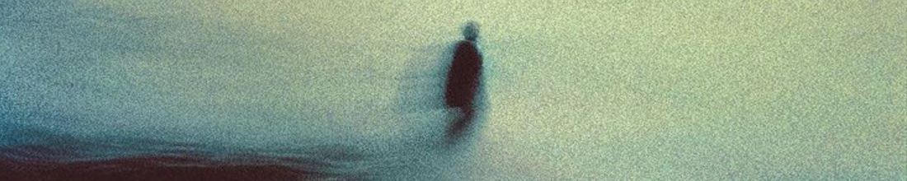

<!-- CINEMATIC HEADER IMAGE -->

  

 

<h1 align="center">Hi, I’m Nabaskar 👋</h1>

  <strong>Designer · 3D Artist · Game Developer</strong>

  <em>
    I work where <strong>design</strong>, <strong>technology</strong>, and <strong>emotion</strong> quietly meet.
  </em>

## 🌒 About

I’m a **Designer, 3D Artist, and Game Developer** focused on creating immersive digital experiences —  
from calm, thoughtful interfaces to interactive 3D and game worlds.

I care deeply about **mood, flow, and interaction** — how something *feels*, not just how it functions.

- UI & interaction design using **Figma / Framer**
- 3D environments, lighting & assets in **Blender**
- Game development with **Unity** & **Unreal Engine**
- Frontend foundations: **HTML, CSS, JavaScript**
- Exploring **Svelte & React** for interactive web experiences

> *Good experiences don’t demand attention — they earn it.*

## 🎮 Game Development

I enjoy building **small worlds and playable experiences** that balance  
visual storytelling with interaction and atmosphere.

- 🎮 **Unity** — gameplay systems, scenes, prototyping
- 🧠 **Unreal Engine** — environments & real-time rendering
- 🌫️ Focus on lighting, mood, and player feel
- 🕹️ Experimenting with mechanics and pacing

  

## 🧩 Tools & Technologies

### 🎨 Design & Creative

  

### 🧊 3D & Game Development

  

  

### 💻 Web & Programming

  

## 📊 Development Snapshot

  
  

## 🐍 Building in Public

  

## 🌐 Connect

  
  &nbsp;&nbsp;&nbsp;
  
  &nbsp;&nbsp;&nbsp;
  

  Still learning. Still building. Still finding my voice.

