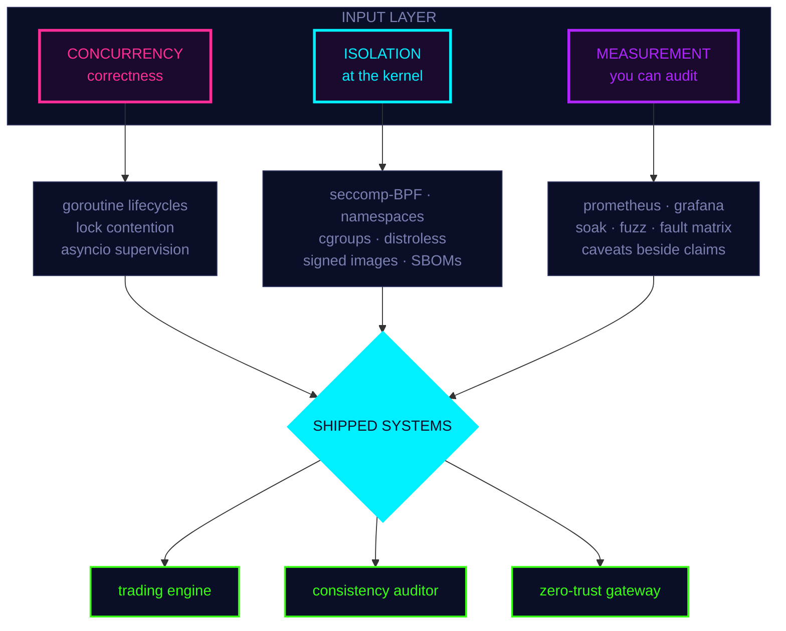

<div align="center">

<pre>
<b>██▄   ██   ▄█▀█▄   ██▀▀▀▀▀█▄ ██▀▀▀▀▀█▄   ▄█▀█▄   ██     ██ ██▄   ▄██   ▄█▀█▄
██▀█▄ ██ ▄█▀   ▀█▄ ██▄▄▄▄▄█▀ ██▄▄▄▄▄█▀ ▄█▀   ▀█▄ ██▄▄▄▄▄██ ██▀█▄█▀██ ▄█▀   ▀█▄
██  ▀███ ██▀▀▀▀▀██ ██     ██ ██   ▀█▄  ██▀▀▀▀▀██ ██     ██ ██     ██ ██▀▀▀▀▀██
▀▀    ▀▀ ▀▀     ▀▀ ▀▀▀▀▀▀▀▀  ▀▀     ▀▀ ▀▀     ▀▀ ▀▀     ▀▀ ▀▀     ▀▀ ▀▀     ▀▀</b>
</pre>


<br/>

<a href="https://nabaskarbrahma.vercel.app/"></a>
<a href="https://www.linkedin.com/in/nabaskar/"></a>
<a href="mailto:nabaskarforcode99@gmail.com"></a>
<a href="https://nabaskarbrahma.itch.io/"></a>


<pre>
▀▄▀▄▀▄▀▄▀▄▀▄▀▄▀▄▀▄▀▄▀▄▀▄▀▄▀▄▀▄▀▄▀▄▀▄▀▄▀▄▀▄▀▄▀▄▀▄▀▄▀▄▀▄▀▄▀▄▀▄▀▄▀▄▀▄▀▄▀▄▀▄▀▄▀▄▀▄
</pre>

</div>

## ▓▒░ BOOT SEQUENCE ░▒▓

```console
nabrahma@localhost:~$ ./init --verbose

  [ OK ]  mounting /dev/kubernetes ........................ controller-runtime v0.19
  [ OK ]  loading seccomp-bpf profiles .................... 1 filter per tool, by subtraction
  [ OK ]  spawning asyncio supervisor .................... 5/5 tasks healthy
  [ OK ]  attaching prometheus exporter .................. 48 metrics, 10 alert rules
  [ OK ]  arming fault injection matrix .................. 60 rows, 20 consecutive passes
  [WARN]  false positive rate ............................ 25-50%, varies per run
  [WARN]  single-run dynamic analysis is a real limitation
  [ OK ]  honesty daemon ................................. running (never disabled)

  >> system online. 4 modules loaded. 0 claims without caveats.

nabrahma@localhost:~$ _
```

<div align="center">
<pre>
░░░░░░░░░░░░▒▒▒▒▒▒▒▒▒▒▒▒▓▓▓▓▓▓▓▓▓▓▓▓████████████▓▓▓▓▓▓▓▓▓▓▓▓▒▒▒▒▒▒▒▒▒▒▒▒░░░░░░░░░░░░
</pre>
</div>

## ▓▒░ CORE ARCHITECTURE ░▒▓



<div align="center">
<pre>
████▓▓▓▓▒▒▒▒░░░░                                                    ░░░░▒▒▒▒▓▓▓▓████
</pre>
</div>

## ▓▒░ MODULES LOADED ░▒▓

<details open>
<summary><code>[01]</code> <b>SHORTCIRCUIT.exe</b> &nbsp;·&nbsp; live trading engine &nbsp;·&nbsp; <code>python asyncio postgres docker</code></summary>

```diff
@ TARGET   NSE equities via Fyers API v3 — real money, real fills
@ SCALE    14.8K LOC / 42 modules / 1 event loop / 5 supervised tasks
@ PIPELINE WS cache -> hybrid -> REST fallback, behind a sliding-window limiter
           enforcing 10/sec + 200/min + 100K/day simultaneously, with a reserved
           priority lane so stop-loss cannot queue behind scanner traffic

- BUG      a WebSocket payload-nesting defect had silently prevented EVERY order
-          fill from ever being confirmed. zero fills logged. for months.
+ FIX      replayed recorded production traffic through the handlers and
+          recovered 89 order IDs from logs that previously yielded nothing

! GUARD    248 tests, 100% branch coverage on order decisions, plus an AST test
!          that FAILS THE BUILD if a strategy module imports anything with I/O
```

</details>

<details>
<summary><code>[02]</code> <b>DRIFTWATCH.exe</b> &nbsp;·&nbsp; distributed consistency auditor &nbsp;·&nbsp; <code>go kubernetes redis zeromq</code></summary>

```diff
@ PURPOSE  detect SILENT divergence between an event stream and its derived
           Redis store, by rebuilding expected state as an independent 3rd consumer

- PROBLEM  8% false positives at 2,000 events/sec — the tool blaming the system
-          for event loss the tool itself caused
+ SOLVED   settlement window derived from MEASURED propagation lag, two-phase
+          confirmation with version fencing, and trust states that classify
+          self-inflicted loss as "suspect" rather than "drift"

@ OPERATOR controller-runtime + kubebuilder: CRD, validating/defaulting webhooks,
           leader election, finalizers. Helm chart + Grafana + 10 alert rules.

! BENCH    1M redis keys swept ......... 5.68s   (target: 10s)
!          1M keys invalidated ......... 1.11us  (generation counter, not per-key)
!          60-min soak ................. 5,388,510 events / 0 dropped / 13 goroutines
!          coverage .................... 91.6% across 10 test levels
```

</details>

<details>
<summary><code>[03]</code> <b>MCP_ZT_GATEWAY.exe</b> &nbsp;·&nbsp; kernel confinement for AI agents &nbsp;·&nbsp; <code>python seccomp docker fastapi</code> &nbsp;·&nbsp; <a href="https://pypi.org/project/mcp-ztgateway/">PyPI</a></summary>

```diff
@ THESIS   an AI tool server's self-description is written by the attacker.
           treat it as untrusted input. declare -> verify -> confine.

@ VERIFY   profile the server under strace -f -yy -ttt inside a
           --cap-drop ALL --read-only container, map syscalls to a capability
           vocabulary, DENY anything the declaration does not cover

@ CONFINE  per-tool seccomp-BPF filters derived BY SUBTRACTION from the verified
           verdict + network namespaces + bind mounts + CONNECT allow-list proxy
           + optional Landlock. filter must survive a real handshake or the
           gateway degrades a tier AND RECORDS THAT IT DID.

- CONFESS  an earlier build reported 100% success. it was two measurement bugs
-          cancelling: a seccomp compiler that stopped every container booting,
-          and a harness that scored those crashes as successful defences.
+ REBUILT  crashes now score INCONCLUSIVE and stay in the denominator. every
+          defence must name its enforcing layer. detection and containment are
+          never merged into one number. the honest figure is 84.6%.
```

</details>

<details>
<summary><code>[04]</code> <b>GAMECODE.exe</b> &nbsp;·&nbsp; sandboxed judge for game devs &nbsp;·&nbsp; <code>go echo postgres nextjs</code></summary>

```diff
@ SANDBOX  C++ / C# / Lua / GDScript in throwaway containers
           no network · read-only rootfs · CPU + 256MB + 128-PID hard caps
           8 verdict states from exit codes, runtime + peak memory read
           straight from the cgroup (sub-millisecond accuracy)

@ API      44 endpoints, 9-package handler -> service -> repository layering
           JWT + bcrypt, refresh tokens stored as SHA-256 hashes and retired
           on every use, delivered over httpOnly cookies

- BEFORE   a stubbed auth layer allowed user impersonation via request body
+ AFTER    RBAC middleware + dual RequireAuth/OptionalAuth so public content
+          stays cacheable while still personalising per user

! CI       validator CLI runs 75 reference solutions against 136 test cases
!          every build — caught 6 latent defects incl. an int64 overflow
```

</details>

<div align="center">
<pre>
████▓▓▓▓▒▒▒▒░░░░                                                    ░░░░▒▒▒▒▓▓▓▓████
</pre>
</div>

## ▓▒░ CRASH LOG // UPSTREAM ░▒▓

<sub>real fixes in other people's codebases · click a repo to open my PRs</sub>

| SEV | REPO | SYMPTOM | ROOT CAUSE | PATCH |
|:---:|:---|:---|:---|:---|
| `P1` | [**HAMi**](https://github.com/Project-HAMi/HAMi/pulls?q=author%3Anabrahma) | node permanently stops accepting MLU pods | lock release called `Nodes().Update()`; scheduler SA only has `patch` | strategic-merge patch, matching the rest of the codebase |
| `P1` | [**kthena**](https://github.com/volcano-sh/kthena/pulls?q=author%3Anabrahma) | goroutine explosion | LRU eviction spawned one goroutine per hash — a single 8k-token request spawned 1,000+ | deleted a deadlock workaround that lock reordering had made obsolete |
| `P2` | [**kthena**](https://github.com/volcano-sh/kthena/pulls?q=author%3Anabrahma) | periodic P99 spikes | token tracker took an **exclusive** lock on the *read* path to GC expired buckets | moved GC to the write path; reads never mutate |
| `P2` | [**kthena**](https://github.com/volcano-sh/kthena/pulls?q=author%3Anabrahma) | ~50us burned per request | `regexp.MatchString` recompiled the pattern on **every** request, per matcher | memoised compiled patterns → **~820ns/op, ~50x faster** |
| `P2` | [**kthena**](https://github.com/volcano-sh/kthena/pulls?q=author%3Anabrahma) | cluster-wide stale metrics | one unresponsive pod stalled a sequential O(N) scrape loop | bounded 100-goroutine semaphore + context cancellation |
| `P3` | [**headlamp**](https://github.com/kubernetes-sigs/headlamp/pulls?q=author%3Anabrahma) | 4 eslint suppressions hiding a real bug | hooks called *after* an early return | hoisted the hooks, deleted all four suppressions |
| `P3` | [**openfoodfacts**](https://github.com/openfoodfacts/openfoodfacts-explorer/pulls?q=author%3Anabrahma) | screen readers announcing decorative images | missing `aria-hidden` on hero imagery | 8 merged fixes across a11y, responsive layout, i18n |

<div align="center">
<pre>
████▓▓▓▓▒▒▒▒░░░░                                                    ░░░░▒▒▒▒▓▓▓▓████
</pre>
</div>

## ▓▒░ TELEMETRY ░▒▓

```
  UPSTREAM_MERGED   ███████████░░░░░░░░░  13 / 24 PRs
  TEST_COVERAGE     ██████████████████░░  91.6%  driftwatch
  BRANCH_COVERAGE   ████████████████████  100%   shortcircuit/orders
  THREAT_DETECTION  █████████████████░░░  84.6%  mcp-ztgateway
  CONTAINMENT       ██████████████████░░  87.5%  mcp-ztgateway
  FALSE_POSITIVES   ███████░░░░░░░░░░░░░  25-50% <- yes, I report this too
```

<div align="center">


</div>

<div align="center">
<pre>
████▓▓▓▓▒▒▒▒░░░░                                                    ░░░░▒▒▒▒▓▓▓▓████
</pre>
</div>

## ▓▒░ LOADOUT ░▒▓

<div align="center">

`CORE`
<br/>


`CLOUD NATIVE`
<br/>


`DATA + BACKEND`
<br/>


`INTERFACE`
<br/>


<sub>legacy save file: <code>unity</code> · <code>c#</code> · <code>blender</code> — where I started, still where I go to play</sub>

</div>

<div align="center">
<pre>
▀▄▀▄▀▄▀▄▀▄▀▄▀▄▀▄▀▄▀▄▀▄▀▄▀▄▀▄▀▄▀▄▀▄▀▄▀▄▀▄▀▄▀▄▀▄▀▄▀▄▀▄▀▄▀▄▀▄▀▄▀▄▀▄▀▄▀▄▀▄▀▄▀▄▀▄▀▄
</pre>

<pre>
┌─────────────────────────────────────────────────────────┐
│                                                         │
│   THE LOUD FAILURE IS CHEAP.                            │
│                                                         │
│   THE ONE THAT NEVER FIRES AN ALERT                     │
│   IS THE ONE THAT COSTS YOU.                            │
│                                                         │
└─────────────────────────────────────────────────────────┘
</pre>

<sub>▓ building the parts nobody sees until they break ▓</sub>

</div>
